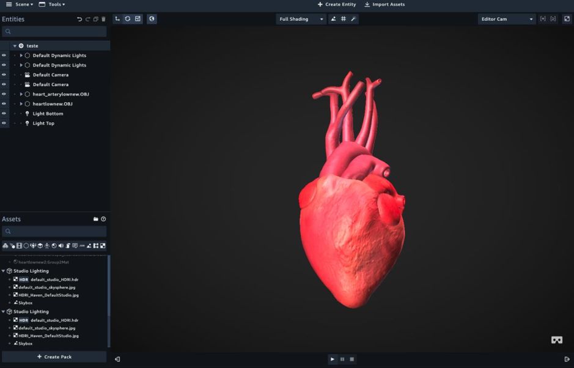

## Amazon Sumerian EDU Demo

The purpose of this demo is show how to use Amazon Sumerian to create a virtual class. You are going to create a virtual environment using Amazon Sumerian, then import our custom resources for our first class and eventually make the class available through an address so students can access the material in a web browser.

To get started you will need an IAM user with the following access:
- Amazon Sumerian

_Note: All the scene objects and textures were created by Gabriel Martini (gabrielmartinigit)_

## Creating a project
1) Open Amazon Sumerian page: https://console.aws.amazon.com/sumerian/
2) In the left side menu, click on **Projects**
3) Create a new project named **First Class** by clicking on **New Project**
4) Click on the **Create new scene** option and create a scene named **Class Heart**

## Importing objects
1) In the top bar click on **Import Assets**
2) In the right side menu, click on **Browse** and select the file **primeira_aula.zip** of this repository and wait for the objects to load
3) At this point the objects have already been loaded and you can make customizations to the scene and objects *(color, camera, lighting, etc.)*. For more information on how to customize your environment see the references at the end

## Publishing the scene
1) At the top menu in the right corner of the screen, click on **Publish**, then click on **Create public link** and the **Publish** button
2) After the scene is published, the message **“Your scene is published and can be viewed by anyone with the link.”** will be displayed, and the link can now be copied and shared with your students

## Reference links
* https://docs.sumerian.amazonaws.com/tutorials/
* https://aws.amazon.com/blogs/media/how-to-create-a-virtual-trainer-with-amazon-sumerian-virtual-reality-and-amazon-machine-learning-part-1/
* https://aws.amazon.com/blogs/publicsector/aws-and-chile-launch-the-data-observatory-project/
* https://www.youtube.com/watch?v=q0eWTWBrahc

## License summary
This sample code is made available under the MIT-0 license. See the LICENSE file.